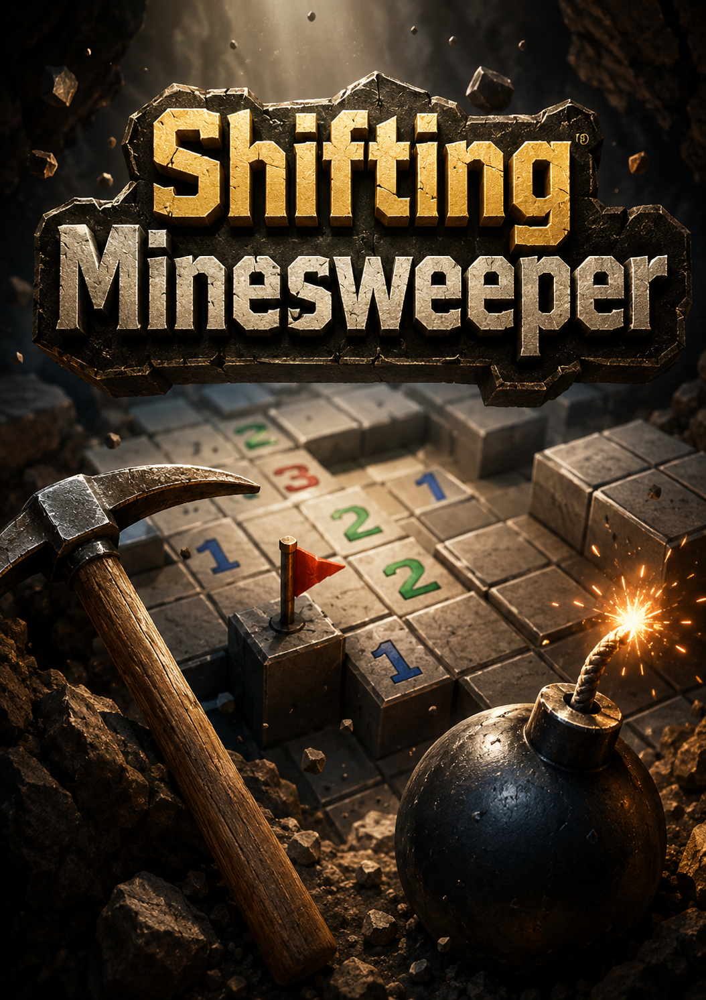
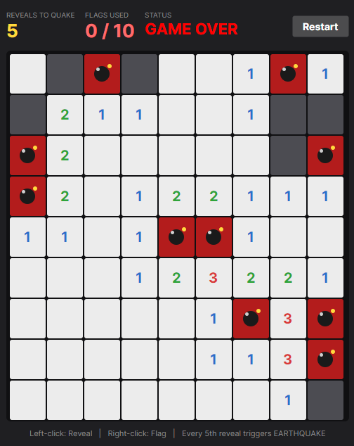

# Shifting Minesweeper

<p align="center">
  
</p>

A 9×9 Minesweeper game with a dynamic twist, built with **F# + .NET 10 + Avalonia 12**.

You play on a 9×9 grid with 10 hidden mines. Every 5th reveal triggers an **EARTHQUAKE** — all flags are lost and every mine shifts one step in a random orthogonal direction (up, down, left, or right). Adapt to the ever-changing board to survive and win.

<p align="center">
  
</p>

## Setup & Execution

The only thing you need is the **.NET 10 SDK**. Everything else (Avalonia, the F# compiler, etc.) is downloaded automatically the first time you run the game.

If you have already installed .NET 10 and just want the short version: clone the repo and double-click `run.bat` on Windows or `run.command` on macOS, or run `./run.sh` from a terminal on Linux. The detailed step-by-step instructions below assume you have done none of that before.

<details>
<summary><b>Step 1 — Install the .NET 10 SDK</b></summary>

The .NET 10 SDK is a free program from Microsoft that lets your computer compile and run F# code. You only need to do this once.

**On Windows**

1. Open this page in your web browser:
   <https://dotnet.microsoft.com/download/dotnet/10.0>
2. Under **".NET 10.0"**, find the **SDK** column and click the **Windows** **x64** installer (most modern PCs are x64; if you have a very new ARM PC use **Arm64**).
3. Run the downloaded `.exe` file and click **Install**. When it finishes, click **Close**.
4. To check it worked, press the **Windows key**, type `cmd`, and open **Command Prompt**. Type:
   ```
   dotnet --version
   ```
   and press **Enter**. You should see something like `10.0.100`. If you see "command not recognized," close and reopen Command Prompt and try again.

**On macOS**

1. Open this page in Safari or another browser:
   <https://dotnet.microsoft.com/download/dotnet/10.0>
2. Under **".NET 10.0"**, find the **SDK** column and click the **macOS** installer:
   - If you have an **Apple Silicon Mac** (M1, M2, M3, M4 — anything from late 2020 onward), pick **Arm64**.
   - If you have an **Intel Mac**, pick **x64**.
   - Not sure which one? Click the Apple menu → "About This Mac". If it says "Chip: Apple M…" it is Apple Silicon. If it says "Processor: Intel…" it is Intel.
3. Open the downloaded `.pkg` file. macOS will ask for your password and walk you through the installer — just keep clicking **Continue** and **Install**.
4. To check it worked, open the **Terminal** app (press **Cmd + Space**, type `terminal`, hit Enter). Type:
   ```
   dotnet --version
   ```
   and press **Return**. You should see something like `10.0.100`.

</details>

<details>
<summary><b>Step 2 — Get the project files</b></summary>

You have two ways to download the code. Either is fine.

**Easiest (no Git needed):**

1. Open this page in your browser:
   <https://github.com/rOsOr9981/cs20200-shifting-minesweeper>
2. Click the green **`< > Code`** button near the top right.
3. Click **Download ZIP**.
4. Find the downloaded `cs20200-shifting-minesweeper-main.zip` file (usually in your **Downloads** folder) and double-click it to unzip. You will end up with a folder named `cs20200-shifting-minesweeper-main`.

**With Git (if you already have Git installed):**

```
git clone https://github.com/rOsOr9981/cs20200-shifting-minesweeper.git
```

This creates a folder called `cs20200-shifting-minesweeper` in whatever directory your terminal is currently in.

</details>

<details>
<summary><b>Step 3 — Run the game</b></summary>

**On Windows**

1. Open the project folder in **File Explorer** (the unzipped folder from Step 2).
2. Double-click **`run.bat`**.
   - If a blue "Windows protected your PC" dialog appears, click **More info** → **Run anyway**. This happens because `.bat` files from the internet are treated as untrusted by Windows; the file is just three lines of plain text and you can open it in Notepad to verify.
3. A black command window will appear and say things like "복원할 프로젝트를 확인하는 중…" / "Restoring NuGet packages…". On the **first run only**, this takes 1–2 minutes while Avalonia downloads. On every later run it is almost instant.
4. A game window titled **"Shifting Minesweeper"** appears. Have fun!

**On macOS**

1. Open the project folder in **Finder** (the unzipped or cloned folder from Step 2).
2. Double-click **`run.command`**.
   - The first time, macOS may show a warning like *"run.command can't be opened because it is from an unidentified developer"*. If that happens, **right-click** (or Control-click) `run.command`, choose **Open**, then click **Open** in the dialog. After this one-time approval, double-clicking works normally.
3. A Terminal window opens and shows "Restoring packages…" and similar messages. On the **first run only** this takes 1–2 minutes while Avalonia downloads. On every later run it is almost instant.
4. A game window titled **"Shifting Minesweeper"** appears. Have fun!
5. When you close the game, the Terminal window will say `[Process completed]`. You can close it manually — it does not close itself.

**On Linux**

Open a terminal in the project folder and run:
```
./run.sh
```
This requires a graphical desktop session (X11 or WSLg). On Debian/Ubuntu-based systems, the script automatically installs the X11 libraries Avalonia needs (via `sudo apt`) the first time you run it — you will be prompted for your password. On non-apt distros (Fedora, Arch, etc.), see the **Troubleshooting** section below for the manual install command.

**Alternative for any OS — direct `dotnet` command**

If `run.bat` / `run.command` / `run.sh` does not work for some reason, you can always run the game manually from inside the project folder:

```
dotnet run
```

This does exactly the same thing the run scripts do.

</details>

<details>
<summary><b>Troubleshooting</b></summary>

- **"dotnet: command not found" or "'dotnet' is not recognized"** — The .NET 10 SDK is not installed yet, or your terminal was already open when you installed it. Close and reopen the terminal and try again. If it still fails, repeat Step 1.
- **"permission denied: ./run.command" or `./run.sh` on macOS/Linux** — Should not happen with a fresh clone (the executable bit is committed in Git), but if you downloaded the ZIP via some tool that strips permissions, run `chmod +x run.command run.sh` once in Terminal.
- **The first run is very slow** — That is normal. NuGet is downloading Avalonia (~80 MB). It only happens once.
- **A white/blank window appears with no grid** — Close it and run again; this is usually a one-off rendering hiccup on the very first launch after install.
- **You see Korean text "복원할 프로젝트를 확인하는 중…"** in the terminal — That is just .NET printing its progress in Korean because of your system locale. It is normal output, not an error.
- **"Unable to load shared library 'libICE.so.6'" on Linux / WSL2** — Avalonia needs X11 libraries that are not always pre-installed on minimal Linux images. `./run.sh` installs them automatically on Debian/Ubuntu-based systems. On other distros, install equivalents of these packages manually — for example on Debian/Ubuntu:
  ```
  sudo apt install -y libice6 libsm6 libx11-6 libxext6 libxrandr2 libxi6 libxcursor1 libxfixes3 libxrender1 libfontconfig1
  ```
  On Fedora, the packages are `libICE libSM libX11 libXext libXrandr libXi libXcursor libXfixes libXrender fontconfig` (via `dnf install`). On WSL2, GUI support (WSLg) is required — Windows 11 includes it by default; on Windows 10 you need an external X server such as VcXsrv.

</details>


## How to Play

<details>
<summary>Expand</summary>

| Mouse | Action |
|-------|--------|
| **Left-click** an unrevealed cell | Reveal it |
| **Right-click** an unrevealed cell | Flag / unflag it |
| **Restart** button (top right) | Start a new game |

- The **first** reveal of every game is always safe **and** opens a satisfyingly large empty area — the 10 mines are placed only after your first click, with both the clicked cell *and its 8 surrounding cells* excluded from the mine layout. This guarantees the clicked cell has zero adjacent mines, which triggers the recursive reveal of all connected safe cells.
- **Flagged cells cannot be revealed.** Left-clicking a flagged cell does nothing — you must first right-click it to remove the flag, then left-click to reveal. This protects you from accidentally detonating a cell you suspect.
- **You can place at most 10 flags** (one per mine). Attempting to flag an 11th cell does nothing — unflag something first.
- Revealing a cell with 0 adjacent mines auto-reveals all connected safe cells.
- Revealing a mine ends the game (**GAME OVER**) and shows every mine as a bomb glyph.
- Every **5th reveal** triggers an **EARTHQUAKE**: the board shakes for about half a second, all flags vanish, and each mine moves one step (up, down, left, or right) to a random non-revealed cell. The animation is **shake-only** — there is no flashing color, to avoid photosensitivity issues.
- After an earthquake the numbers on revealed cells update to reflect the new mine positions.
- You **win** when every non-mine cell has been revealed.

The top status bar shows reveals remaining until the next earthquake, the flag count, and whether you are still playing.

</details>

## Board Legend

<details>
<summary>Expand</summary>

| Visual | Meaning |
|--------|---------|
| Dark gray cell | Hidden |
| Red **F** on dark gray | Flagged |
| Light cell, colored digit | Revealed (1=blue, 2=green, 3=red, …) |
| Light cell, blank | Revealed with 0 adjacent mines |
| Red cell, bomb glyph (drawn with vector shapes) | Mine (shown after game over) |

</details>

## Changes from Proposal

The proposal described a **CLI** game; the final implementation is a **GUI** game built with Avalonia. The game logic (mine count, shift rules, win condition) is unchanged — only the input/output form was amended, plus a few player-friendly additions described below. The change of form is allowed by Section 2 of the project specification, which explicitly permits "text-based, graphical, web-based, or [other] form" games.

### Requirement amendments

Only three of the nine proposal requirements have been amended; all others are implemented exactly as originally proposed.

| Req # | Original proposal text | Final implementation |
|:---:|---|---|
| 1 | "display a 9×9 board in the terminal with 10 hidden mines" | display a 9×9 board **in a desktop window** with 10 hidden mines |
| 2 | "make a move by entering an action command and coordinates (e.g., `R 3 4` to Reveal, `F 3 4` to Flag)" | make a move by **left-clicking** a cell to reveal it or **right-clicking** to flag it |
| 3 | "the game **prints** a 'Game Over' message and ends" | the game **shows GAME OVER in the status bar** and ends (no further input is accepted; Restart starts a new game) |
| 4–9 | (unchanged) | implemented exactly as the proposal specifies |

**Justification for the form change:** the EARTHQUAKE twist is the defining feature of this project, and it depends on the player *seeing* the board change. In a terminal the shift is barely felt — a static board redraws with slightly different numbers. In the GUI, the shake animation gives the event the visceral "the floor moved" quality the proposal was aiming for. (This change was confirmed as justifiable by the TAs on the course GitHub Discussions before implementation.)

### Additional player-friendly behaviors

<details>
<summary>Expand</summary>

The following were added in the GUI version. None of them remove or contradict any proposal requirement — they only restrict the cases under which an action is allowed, or refine *when* / *where* a state is computed.

- **First-click safety with an opening flood:** the first reveal of every game is guaranteed to not be a mine, and is also guaranteed to open a non-trivial empty area. The 10 mines are generated lazily after the first click rather than at game start, and both the clicked cell *and its 8 surrounding cells* are excluded from the candidate set, so the clicked cell has zero adjacent mines and the recursive reveal kicks in. The mine count (10) and every other rule are unchanged from the proposal — this only changes *when* and *where* the mines are generated, not how many or how they behave.
- **Flag protects against accidental reveal:** left-clicking a cell that the player has already flagged does nothing, instead of revealing it. The player must explicitly unflag before revealing. This is a standard quality-of-life rule in Minesweeper variants and does not change any original requirement — it only restricts the cases in which a reveal can occur.
- **Flag count capped at 10:** the player cannot place more flags than there are mines. This is a standard sanity guard that the proposal did not explicitly mention.
- **Photosensitivity-safe EARTHQUAKE animation:** an earlier iteration of the animation flashed a yellow overlay and a red "EARTHQUAKE!" banner during the shake. Both were removed so the animation is just the shake. This is an accessibility-driven simplification — the underlying gameplay event (clear flags, shift mines, recompute numbers) is unchanged.

</details>

## Requirements Compliance Checklist

The table below maps each of the nine proposal requirements to its implementation location and a quick in-game verification step, so a reviewer can audit faithfulness without reading the source.

| Req # | Proposal requirement (summary) | Implementation | How to verify in play |
|:---:|---|---|---|
| 1 | 9×9 board, 10 hidden mines | `Board.fs`: `SIZE = 9`, `NUM_MINES = 10` | At startup, count the cells (9 rows × 9 columns); the status bar shows `0 / 10` flags meaning 10 mines exist. |
| 2 | Input is an action + coordinates | `MainWindow.axaml.fs`: `HandleLeftClick` (reveal) and `HandleRightClick` (flag) wired to each cell's `PointerPressed` | Left-click reveals a cell; right-click toggles a flag. |
| 3 | Reveal mine ⇒ Game Over | `MainWindow.axaml.fs`: `HitMine` branch in `HandleLeftClick` sets `gameOver <- true` and refreshes the board | Reveal cells until you hit a mine — the status changes to `GAME OVER`, every mine is shown as a bomb glyph, and further input is ignored. |
| 4 | Safe cell shows adjacent count; 0 ⇒ recursive reveal | `Board.fs`: `revealCells` (BFS), `countAdjacentMines` | Click a cell adjacent to mines to see a colored digit; click into an empty region to see auto-flood reveal. |
| 5 | Every 5th Reveal triggers Shift | `Board.fs`: `handleReveal` checks `newCount % 5 = 0` | The `REVEALS TO QUAKE` counter ticks down each reveal; on the 5th, the board shakes. |
| 6 | Shift clears flags and moves each mine 1 step orthogonally | `Board.fs`: `shiftMines` uses 4-direction `dirs` and sets `Flags = Set.empty` | Place a flag, trigger a quake — the flag is gone, and number cells along the board change as mines have shifted. |
| 7 | Mines never shift into revealed cells; stay if no valid move | `Board.fs`: `shiftMines` filters by `not (Set.contains _ state.Revealed)` | Revealed cells stay safe across earthquakes; the mine count never drops. |
| 8 | After Shift, revealed cells' numbers update | `RefreshCell` recomputes `countAdjacentMines` on every refresh from the current mine set | The same revealed cell may show a different digit before vs. after a quake. |
| 9 | Win when all non-mine cells are revealed | `Board.fs`: `isWon` (called after each reveal and after each quake) | Reveal every safe cell; status changes to `YOU WIN!`. |

## Project Structure

<details>
<summary>Expand</summary>

```
├── Board.fs                   ← Game logic (mines, reveal, shift, win)
├── MainWindow.axaml(.fs)      ← Game window, click handlers, animations
├── App.axaml(.fs)             ← Application entry
├── Program.fs                 ← Avalonia bootstrap
├── ShiftingMinesweeper.fsproj
├── app.manifest
└── run.bat, run.command, run.sh  ← Launchers (Windows / macOS / Linux)
```

</details>

## Use of LLM

<details>
<summary>Expand</summary>

I wrote all of the core code for this project myself, and used an LLM (Claude) for final review and polishing after my implementation was working. The title poster (`Poster.png`) shown at the top of this README was also generated using an image-generation LLM; it is purely decorative and is not part of the game.

- **What I used the LLM for:** Reviewing my finished code for bugs, suggesting cleaner F# idioms, helping format the README, double-checking that every requirement in my proposal was reflected in the implementation, and helping me port the CLI version to an Avalonia GUI (XAML layout scaffolding, animation timing for the EARTHQUAKE effect, F#/Avalonia event-handler boilerplate).

- **What I had to manually change or reprompt:** The LLM's first pass at the mine-shift logic did not handle the edge case where two mines wanted to move to the same cell, so I had to reprompt it to add a conflict-resolution pass (process mines in random order and track already-claimed positions). It also initially used 8 directions for the shift; I reprompted it to restrict the shift to up/down/left/right as my proposal specifies. For the GUI port, the LLM's first attempt at the earthquake animation used raw `Task.Delay` continuations, which I had to ask it to replace with `DispatcherTimer` so all updates would land on the UI thread reliably.

- **What the LLM was not able to do correctly:** The LLM could not actually launch and play the GUI window — it could only check that the app started without crashing. As a result, **finding bugs through real play was entirely on me.** Every gameplay defect was discovered by me playing the game and noticing something off: the mine count silently dropping from 10 to 9 across several earthquakes (caused by two shifting mines being forced into the same cell), the flag counter being able to climb past 10 (no cap was enforced), the first reveal opening only a single boring cell instead of a real area, and several smaller layout and color issues. In every case, the LLM only produced a correct fix after I described the exact symptom; it never anticipated any of these problems on its own. The same applied to the feel of the shake (offset magnitudes, timing) and the readability of the colored numbers — I tuned those myself by running the binary repeatedly.

</details>
